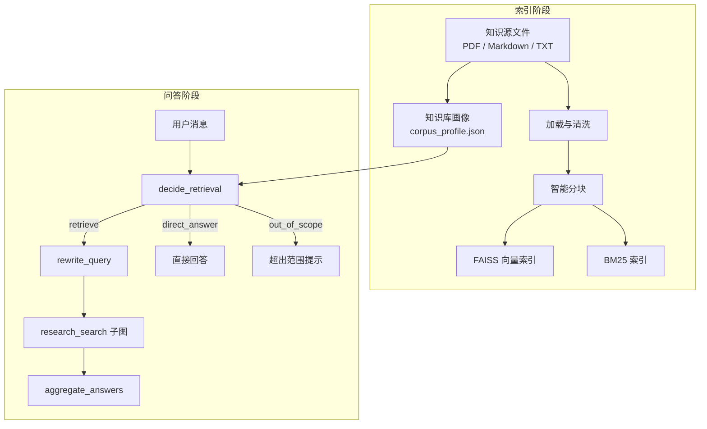

# Agentic RAG


## 项目简介

这是一个基于 LangGraph 的 Agentic RAG Demo，包含本地索引、混合检索、任务路由和 Gradio UI。

当前版本的重点不是“和单个 PDF 聊天”，而是“围绕一组有边界的知识源构建知识库”。系统会先根据用户消息判断是否需要检索，再决定走直接回答、知识库检索，或提示问题超出当前知识库范围。

## 功能特性

- 混合检索：BM25 + FAISS 融合召回。
- Agent 编排：基于 LangGraph 的显式节点与边。
- 多模型路由：不同任务可使用不同模型，例如 `decide_retrieval`、`rewrite_query`、`summarize_history`、`aggregate_answers`、`research_search`。
- 知识库画像：支持为当前索引维护 `corpus_profile.json`，描述知识库名称、内容摘要、覆盖范围和使用说明。
- 三态路由：用户问题会被路由为 `retrieve`、`direct_answer` 或 `out_of_scope`。
- Gradio 工作台：UI 包含“知识库构建”和“智能问答”两个视图，适合演示企业知识库场景。
- 流式输出：问答阶段支持 LangGraph 事件流。
- 离线模式：在无模型配置时可退化为仅检索结果展示。

## 系统架构



## 快速开始

环境要求：Python 3.12+，建议使用 `uv`

### 本地运行

```bash
# 克隆项目
git clone <repo-url>
cd agentic_rag

# 安装依赖
uv sync

# 配置环境变量
cp .env.example .env

# 可选：先通过 CLI 索引
python main.py index path/to/knowledge_sources

# 启动 UI
python main.py ui
```

启动后建议按下面顺序体验：

1. 进入“知识库构建”页。
2. 填写知识库名称、内容摘要、覆盖范围、使用说明。
3. 上传 `.pdf`、`.md` 或 `.txt` 文件并构建索引。
4. 进入“智能问答”页，根据顶部展示的“当前知识库画像”提问。

### CLI 提问

```bash
python main.py ask "你的问题"
```

## UI 工作流

### 1. 知识库构建

在 UI 中，先定义知识库边界，再导入知识源：

- 知识库名称：这套语料是什么。
- 内容摘要：1 到 3 句话概括语料主题。
- 覆盖范围：适合回答什么，不适合回答什么。
- 使用说明：给后续问答和检索路由提供边界提示。

这些信息会保存到：

- `data/index/corpus_profile.json`

### 2. 智能问答

问答页顶部会始终展示“当前知识库画像”。

系统会根据：

- 用户最新消息
- 对话摘要
- 当前知识库画像

做一次路由决策：

- `retrieve`：进入检索流程
- `direct_answer`：不检索，直接回答
- `out_of_scope`：提示问题超出当前知识库范围

## 检索路由说明

当前主图流程如下：

```text
summarize_history
-> decide_retrieval
-> direct_answer | rewrite_query -> research_search -> aggregate_answers | out_of_scope_answer
```

其中：

- `decide_retrieval` 只负责路由决策，不再负责 query rewrite。
- `rewrite_query` 只负责把用户问题改写成适合检索的 self-contained queries。
- `out_of_scope_answer` 会基于知识库画像提示用户当前知识库的边界。

## 配置参考

### 基础 LLM 配置

| 变量名 | 描述 | 默认值 |
|--------|------|--------|
| OPENAI_API_KEY | LLM API 密钥 | 必填 |
| OPENAI_API_BASE | LLM API 地址 | 必填 |
| LLM_MODEL | 默认模型名称 | 必填 |
| LLM_TEMPERATURE | 默认生成温度 | 0.2 |

### 分任务模型配置

| 变量名 | 描述 | 默认值 |
|--------|------|--------|
| LLM_MODEL_RESEARCH_SEARCH | 检索子图模型 | 同 `LLM_MODEL` |
| LLM_MODEL_DECIDE_RETRIEVAL | 路由决策模型 | 同 `LLM_MODEL` |
| LLM_MODEL_REWRITE_QUERY | 查询改写模型 | 同 `LLM_MODEL` |
| LLM_MODEL_SUMMARIZE_HISTORY | 对话摘要模型 | 同 `LLM_MODEL` |
| LLM_MODEL_AGGREGATE_ANSWERS | 聚合回答模型 | 同 `LLM_MODEL` |
| LLM_MODEL_DECISION | 路由决策兼容别名 | 可选 |
| LLM_MODEL_REWRITE | 查询改写兼容别名 | 可选 |
| LLM_MODEL_SUMMARIZE | 摘要兼容别名 | 可选 |
| LLM_MODEL_AGGREGATE | 聚合兼容别名 | 可选 |

### 索引与检索配置

| 变量名 | 描述 | 默认值 |
|--------|------|--------|
| EMBEDDING_MODEL | 嵌入模型 | `text-embedding-3-small` |
| EMBEDDING_API_KEY | 嵌入 API 密钥 | 同 `OPENAI_API_KEY` |
| EMBEDDING_API_BASE | 嵌入 API 地址 | 同 `OPENAI_API_BASE` |
| CHUNKER_TYPE | 分块策略 | `recursive` |
| CHUNK_SIZE | 分块大小 | 未显式设置 |
| CHUNK_OVERLAP | 分块重叠 | 未显式设置 |
| RETRIEVER_K | 检索结果数 | 10 |
| FUSION_ALPHA | 融合权重 | 0.5 |
| DATA_DIR | 数据目录 | `data/` |
| FAISS_DIR | FAISS 索引目录 | `data/index/faiss/` |
| BM25_PATH | BM25 索引路径 | `data/index/bm25.pkl` |

### Agent 运行配置

| 变量名 | 描述 | 默认值 |
|--------|------|--------|
| MAX_TOOL_CALLS | 最大工具调用次数 | 8 |
| MAX_ITERATIONS | 最大迭代次数 | 10 |
| MAX_CONTEXT_TOKENS | 最大上下文 Token | 5000 |
| KEEP_MESSAGES | 对话压缩后保留消息数 | 20 |
| OFFLINE_MODE | 是否启用离线模式 | false |
| LOG_LEVEL | 日志级别 | INFO |

## 项目结构

```text
agentic_rag/
├── agent/                  # 主图、节点、提示词、状态与工具
├── core/                   # 配置、工厂、持久化、知识库画像
├── indexing/               # 加载、分块、Embedding、检索、向量库
├── llms/                   # LLM 路由与 ChatOpenAI 适配
├── ui/                     # Gradio UI
├── data/                   # 本地索引和知识库画像输出目录
├── tests/                  # 测试
├── main.py                 # CLI 入口
└── pyproject.toml          # 项目依赖与元数据
```

## 输出文件

构建知识库后，默认会在 `data/index/` 下生成：

- `faiss/`：FAISS 向量索引
- `bm25.pkl`：BM25 索引
- `corpus_profile.json`：知识库画像

## 开发说明

```bash
# 安装开发依赖
uv sync --dev

# 代码风格检查
uv run ruff check .

# 运行测试
uv run pytest -v
```

## License

MIT License
